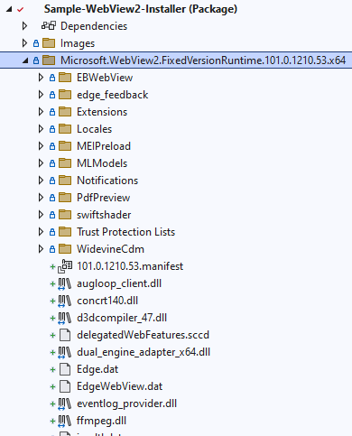

# MSIX: Windows App SDK - WinUI 3 - WebView2 Runtime Install

## Description

**selfcontained** branch: (current branch) This sample installs the [WebView2 Fixed](https://developer.microsoft.com/en-us/microsoft-edge/webview2/). This will install the WebView2 runtime in 'Fixed Version distribution mode'. This works well for scenarios where the app may be installed without an internet connection.

**main** branch: This sample installs the [WebView2 Evergreen standalone installer](https://developer.microsoft.com/en-us/microsoft-edge/webview2/). This will install the WebView2 runtime in scenarios where WebView2 runtime is not already installed.

For more information on WebView2 distribution modes, see here: [Distribute your app and the WebView2 Runtime](https://docs.microsoft.com/en-us/microsoft-edge/webview2/concepts/distribution)

## Built with

* [Visual Studio 2022 (17.3 Preview 1)](https://visualstudio.com)

* [Windows App SDK (1.1.0 - Preview 3)](https://github.com/microsoft/WindowsAppSDK/releases/tag/v1.1.0-preview3)

* .NET 6 (6.0.5)

* [WebView2 Fixed Runtime](https://developer.microsoft.com/en-us/microsoft-edge/webview2/). Version 101.0.1210.53
## Projects

**Sample-WebView2** A WinUI 3 Packaged app hosting the WebView2 control. You will see the default Bing.com page displayed. Clicking the button will launch the Twitter.com home page. The changes documented [here](https://docs.microsoft.com/en-us/windows/apps/package-and-deploy/self-contained-deploy/deploy-self-contained-apps) have been applied to this project and are required to build the project as self-contained.

Code changes are required to that the WebView2 runtime loads properly in the app. The changes are documented [here](https://docs.microsoft.com/en-us/microsoft-edge/webview2/concepts/distribution#details-about-the-fixed-version-runtime-distribution-mode) and have been applied to this project.

**Sample-WebView2-Installer (Package)** The MSIX packaging project. This contains the fixed WebView2 runtime. **Not included in this repo.** You must copy the contexts of the WebView2 fixed runtime .CAB file, downloaded from [here](https://developer.microsoft.com/en-us/microsoft-edge/webview2/), to this folder. After doing so, your packaging project should look something like the screenshot below. (Note: Not all files are displayed due to space constraints.)

